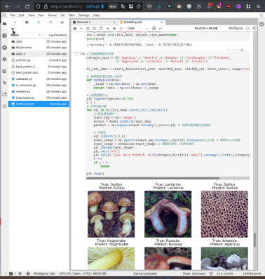

# MindSpore-Misson-5

上一个阶段使用ModelArts训练了一个蘑菇分类器，该分类器可以对9种蘑菇进行分类。

现在，请使用上一个阶段训练好的网络作为本作业的backbone网络，训练一个可以分类另外2种新蘑菇的分类器。

## 数据集

本作业使用kaggle的另一个蘑菇数据集，只需对其中的两种新蘑菇进行分类：

-   Exidia：黑耳，又称为黑胶菌，分布于我国吉林、河北、山西、宁夏、青海、四川、广西、海南,西藏等地，无毒。

-   Inocybe：丝盖伞，又称毛丝盖菌、毛锈伞，分布于我国河北、吉林、江苏、山西、四川、云南、甘肃、新疆等地，有毒。


## 环境

使用云主机的Ascend计算

## 特征提取

下面是9蘑菇分类的实验截图。保留其学习到的特征：best\_param\_backbone.ckpt



选择网络、选择损失函数、优化器、模型。

## 训练

```
model.train(config.epochs, train\_data, callbacks=cb)
```


## 模型评估

### 可视化loss


### 可视化accuracy


### 测试效果

accuracy 约 0.94


## 效果展示


